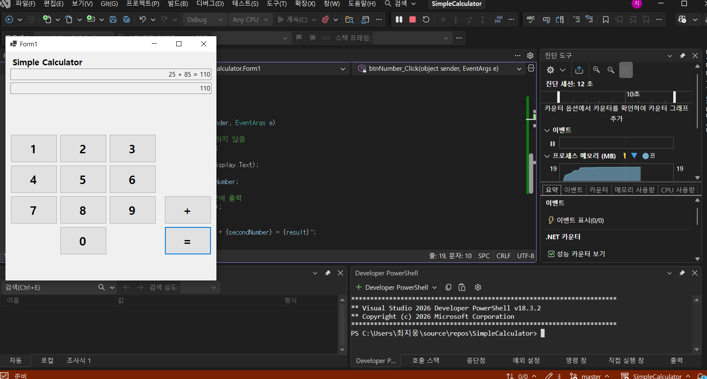

# (C# 코딩) 나만의 계산기

# 개요- C# 프로그래밍 학습
	- 1줄 소개: 사칙 연산이 가능한 계산기 프로그램
	- 사용한 플랫폼:
		- C#, .NET Windows Forms, Visual Studio, GitHub
	- 사용한 컨트롤:
		- TextBox: 사용자 입력과 결과 표시
		- Button: 숫자와 연산자 입력
		- Label: 프로그램 이름 표시
	- 사용한 기술과 구현한 기능:
		- Visual Studio를 이용하여 UI 디자인
		-int.Parse(txtDisplay.Text); 로 인한 텍스트 정수 변환
		-Button btn = sender as Button; 로 클릭된 버튼을 Button 타입으로 변환
		-btnNumber_Click에 참조를 여러개 연결해 여러 숫자 버튼을 하나의 이벤트로 처리
		-txtResult.Text = result.ToString(); 계산된 정수를 문자열로 변환하여 결과 표시

## 실행 화면 (과제1)
	- 과제1 코드의 실행 스크린샷
	

	- 과제 내용
	- TextBox(입력표시, 결과표시), Button(계산) 등을 적절히 배치
	- 숫자 Button 클릭 시 TextBox에 표시합니다. 2가지 방법으로 표시
	- 2개의 피연산자의 입력값을 Int로 바꾸어 더하기 계산을 수행하고 그 결과를 저장
	- 계산 결과 값을 문자열로 변환하여 표시

	- 구현 내용과 기능 설명
	- 입력값 출력창과 결과값 출력 창을 2개 배치 0~9까지의 숫자 버튼 배치 +와= 버튼 배치
	- 입력값을 정수로 변환하며 저장
	- 출력값을 문자열로 변환하여 결과창에 출력
	- 두 수를 더한 값과 식을 Text박스에 출력 
	- 키보드 엔터를 누르면 =와 같은 기능 수행