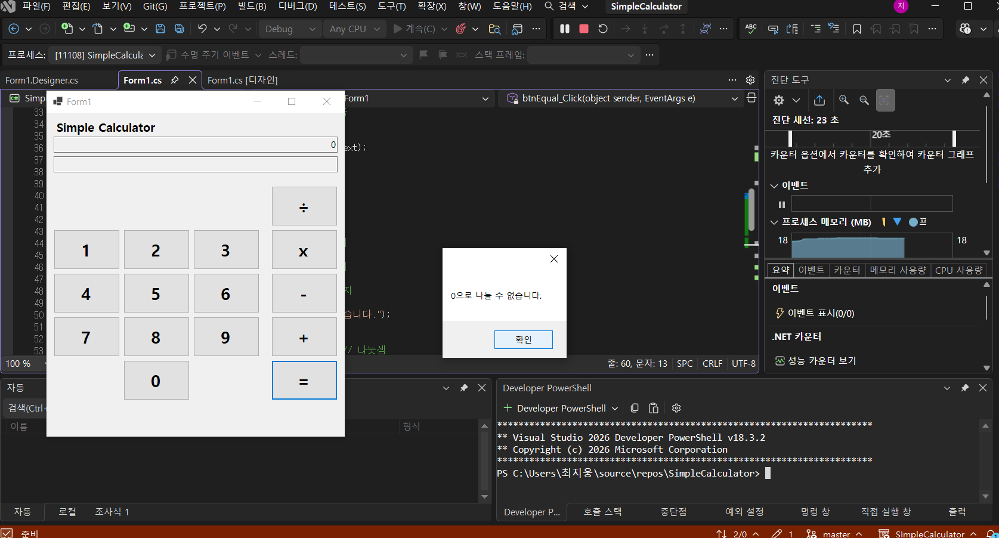
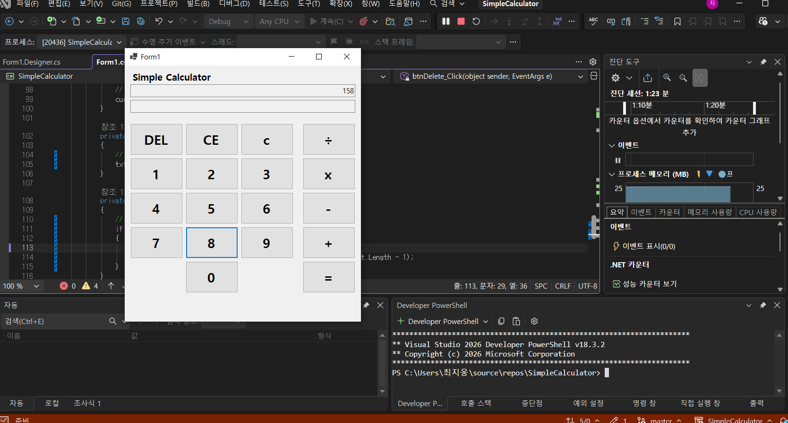

# (C# 코딩) 나만의 계산기

# 개요- C# 프로그래밍 학습
	- 1줄 소개: 사칙 연산이 가능한 계산기 프로그램
	- 사용한 플랫폼:
		- C#, .NET Windows Forms, Visual Studio, GitHub
	- 사용한 컨트롤:
		- TextBox: 사용자 입력과 결과 표시
		- Button: 숫자와 연산자 입력
		- Label: 프로그램 이름 표시
	- 사용한 기술과 구현한 기능:
		- Visual Studio를 이용하여 UI 디자인
		- int.Parse(txtDisplay.Text); 로 인한 텍스트 정수 변환
		- Button btn = sender as Button; 로 클릭된 버튼을 Button 타입으로 변환
		- btnNumber_Click에 참조를 여러개 연결해 여러 숫자 버튼을 하나의 이벤트로 처리
		- txtResult.Text = result.ToString(); 계산된 정수를 문자열로 변환하여 결과 표시
		- if (btn.Text == "÷")로 ÷ 버튼이면 currentOperator = "/"; 내부는 / 사용
		- string displayOperator = currentOperator == "/" ? "÷" : currentOperator; 화면에는 ÷로 다시 표시

## 실행 화면 (과제1)
	- 과제1 코드의 실행 스크린샷
	

	- 과제 내용
	- TextBox(입력표시, 결과표시), Button(계산) 등을 적절히 배치
	- 숫자 Button 클릭 시 TextBox에 표시합니다. 2가지 방법으로 표시
	- 2개의 피연산자의 입력값을 Int로 바꾸어 더하기 계산을 수행하고 그 결과를 저장
	- 계산 결과 값을 문자열로 변환하여 표시

	- 구현 내용과 기능 설명
	- 입력값 출력창과 결과값 출력 창을 2개 배치 0~9까지의 숫자 버튼 배치 +와= 버튼 배치
	- 입력값을 정수로 변환하며 저장
	- 출력값을 문자열로 변환하여 결과창에 출력
	- 두 수를 더한 값과 식을 Text박스에 출력 
	- 키보드 엔터를 누르면 =와 같은 기능 수행

## 실행 화면 (과제2)
	- 과제2 코드의 실행 스크린샷
	(img/3.png)

	- 과제 내용
	- 뺄셈(-), 곱셈(*), 나눗셈(/) 버튼 추가
	- 이벤트 연결
	- 각 버튼 클릭 시 연산자만 변경하여 동일 로직 적용
	- 구현 내용과 기능 설명
	- 뺄셈, 곱셈, 나눗셈 버튼 추가
	- 덧셈, 뺄셈, 곱셈, 나눗셈 이벤트 하나로 작동하게 구현
	- btnEqual_Click 속 내부 연산자로 계산 수행
	- 0으로 나누기 방지
	- 디스플레이 화면으론 /를 ÷으로 보이게 구현

## 실행 화면 (과제3)
	- 과제3 코드의 실행 스크린샷
	(img/5.png)(img/6.png)(img/7.png)

	- 과제 내용
	- C 버튼
	-  현재의 모든 내용을 삭제하고 처음 (초기화된) 상태로 되돌아감
	- CE 버튼
	- 마지막 입력한 피연산자(Operand) 값을 삭제함
	- Del 버튼
	-  마지막 입력된 글자 하나 (숫자 하나) 값을 삭제함

	- 구현 내용과 기능 설명
	- C 버튼을 누르면 현재의 모든 내용을 삭제
	- CE 버튼을 연산자를 찾아 마지막 피연산자 삭제
	- Del 버튼을 누르면 string에서 마지막 입력된 값을 삭제함
	- 결과 값이 나온후 CE를 누르면 초기화
